## Dois Reels
do evento

MANUAL DE EDIÇÃO PARA CAPCUT DESKTOP

**Reel 1:** O ritmo da quadra | 24 segundos
**Reel 2:** O que fica depois do jogo | 30 segundos

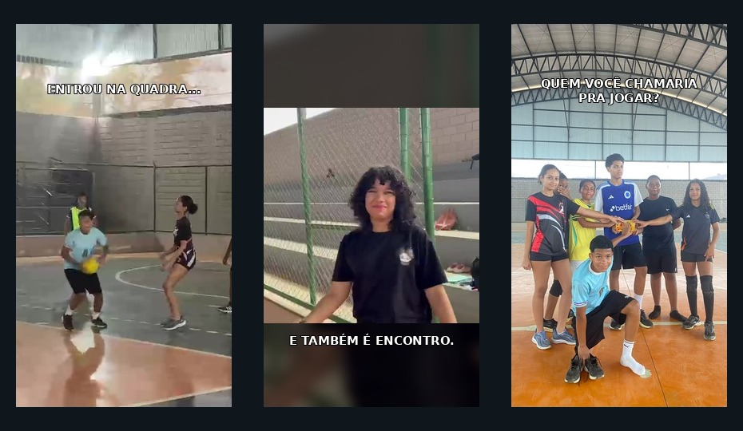

20 planos com pontos de entrada e saída, duração de timeline, velocidade, composição vertical, keyframes, textos e decisões de acabamento.

Base analisada: videos e fotos(1).zip, fornecido nesta conversa. Documento elaborado em 04/09/2026. As datas nos nomes dos arquivos não confirmam a data do evento.

**Limite da análise:** revisão visual e medição técnica realizadas. A escuta e a transcrição das falas não foram possíveis nesta sessão. Os dois roteiros estão fechados como montagens visuais com textos editoriais e música; não reproduzem depoimentos.

---

## Leitura do material e decisões

### O que aparece nas imagens

Um encontro/atividade esportiva em ginásio coberto: participantes com e sem coletes fluorescentes trocam passes com as mãos, correm e se posicionam perto das traves. A dinâmica é compatível com handebol ou uma atividade recreativa semelhante; a modalidade e o nome oficial do evento não estão confirmados. Há pessoas falando para a câmera, gestos espontâneos junto à arquibancada e uma foto de sete participantes com as mãos reunidas no centro.

A camiseta rosa traz a expressão Educação Física. Esse detalhe contextualiza o ambiente, mas não confirma instituição, função profissional, organização ou vínculo das pessoas. Não há base suficiente para publicar nome, cidade, data do evento, número de inscritos, vencedores, placar ou próxima edição.

### Resultado editorial

| Peça | Função | Desenvolvimento |
| --- | --- | --- |
| R1  /  24 s | Energia e vontade de compartilhar | Recepção da bola → deslocamento → troca de passes → rostos → foto → retorno à recepção. |
| R2  /  30 s | Memória e identificação | Mãos reunidas → atividade → encontros e sorrisos → bastidores → grupo → convite para compartilhar. |

### Melhores escolhas

**Ação:** V05 de 00:00.700 a 00:06.700, por oferecer recepção e corrida com continuidade. **Gesto humano:** V01 de 01:12.250 a 01:13.750, com olhar, sorriso e aceno. **Fechamento:** F02, a fotografia com mais resolução e maior valor de memória. **Pessoas diante da câmera:** V02, usado apenas como apoio visual nesta versão.

### O que retirar da montagem

Viradas rápidas para arquibancada e piso, esperas prolongadas, reposicionamentos sem ação nova e dois arquivos de imagem que são capturas de tela de reprodução. Descartar significa excluir destes Reels; preservar todos os originais. As falas não foram classificadas como ruins: ficaram fora porque seu conteúdo não pôde ser validado por escuta.

### Método e precisão

Os cinco vídeos foram decodificados e percorridos visualmente ao longo da duração total por sequências de quadros. A varredura de cerca de um quadro por segundo foi complementada por 300 quadros em tempos explícitos, com intervalos de 0,25 a 0,5 s nos trechos candidatos, além de verificações de extremos e recortes. Isso não equivale a uma audição nem a assistir continuamente a todos os quadros em tempo real.

As fichas definem tempos exatos de montagem. Cada corte deve cair no primeiro quadro disponível no tempo indicado ou imediatamente após ele. A diferença máxima esperada é um quadro da fonte. Não são tempos de palavras ou frases faladas. A duração final da timeline, em 30 fps, é a referência que deve fechar exatamente.

---

## Mapa dos nomes dos arquivos

Os códigos abaixo evitam confusão entre arquivos quase iguais. Usar o nome completo para localizar a mídia; não confiar só no horário nem remover o sufixo (1). Não é necessário renomear o material para executar o roteiro.

| ID | Nome original completo | Conteúdo e destino |
| --- | --- | --- |
| V01 | WhatsApp Video 2026-09-04 at 09.21.35 (1).mp4 | Jogo, movimentos de câmera, acenos e fala ao final. |
| V02 | WhatsApp Video 2026-09-04 at 09.21.35.mp4 | Quatro pessoas diante da câmera; depois retorna ao jogo. |
| V03 | WhatsApp Video 2026-09-04 at 09.21.36.mp4 | Jogo mais escuro, enquadramento lateral. Reserva. |
| V04 | WhatsApp Video 2026-09-04 at 20.06.28 (1).mp4 | Jogo em 720p, quase 60 fps; reunião ao final. |
| V05 | WhatsApp Video 2026-09-04 at 20.06.28.mp4 | Ação em 720p, quase 60 fps; recepção e corrida. |
| F01 | WhatsApp Image 2026-09-04 at 09.21.36 (1).jpeg | Captura de tela vertical de passe; fora dos Reels. |
| F02 | WhatsApp Image 2026-09-04 at 09.21.36 (2).jpeg | Foto vertical do grupo; usar nos dois Reels. |
| F03 | WhatsApp Image 2026-09-04 at 09.21.36.jpeg | Captura de tela escura, com grandes faixas; fora dos Reels. |

### Organização do pacote entregue

| Item | Uso |
| --- | --- |
| manual_reels_capcut.pdf | Consulta visual principal e fichas de cada plano. |
| manual_reels_editavel.md | Mesmo conteúdo em texto editável. As imagens estão na pasta referencias. |
| roteiros_dados.json | Dados estruturados dos cortes e keyframes. Não é um projeto nativo nem arquivo importável de timeline do CapCut. |
| R1_textos_editoriais.srt / R2_textos_editoriais.srt | Blocos de texto já temporizados. Importar como legendas e aplicar o estilo do manual. Não são transcrições. |
| audio/ | Duas bases instrumentais de apoio, com duração exata de 24 s e 30 s. |
| referencias/ e fontes/ | Comparações de início/meio/fim, limites dos recortes e fonte usada nas referências. |

O pacote não repete os vídeos originais. Eles devem ser extraídos do ZIP que você já recebeu. O manual entrega a montagem especificada, não um projeto .capcut nem os dois vídeos finais exportados.

---

## Análise técnica

| ID | Duração | Resolução | FPS médios | Bitrate vídeo | Quadros |
| --- | --- | --- | --- | --- | --- |
| V01 | 01:30.028 | 832 x 464 | 30.002 | 660 kb/s | 2701 |
| V02 | 01:32.328 | 832 x 464 | 30.002 | 772 kb/s | 2770 |
| V03 | 00:13.887 | 816 x 464 | 29.813 | 773 kb/s | 414 |
| V04 | 00:32.603 | 1280 x 720 | 59.963 | 1808 kb/s | 1955 |
| V05 | 00:11.723 | 1280 x 720 | 59.966 | 1822 kb/s | 703 |

**Total de vídeo:** 240,570 s, aproximadamente 4 min e 0,57 s. São 5 vídeos e 3 imagens. Os vídeos são H.264, progressivos, 8 bits, yuv420p, SDR BT.709, com áudio AAC estéreo a 44,1 kHz e aproximadamente 62-65 kb/s. As médias de FPS diferem ligeiramente de 30 e 60; não tratar estes arquivos como masters perfeitamente constantes.

### Resolução e consequências no vertical

Um recorte 9:16 usando toda a altura de V01/V02 retém só 261 x 464 pixels, cerca de 31% da largura original. Para ocupar 1080 x 1920, é ampliado cerca de 4,14 vezes em cada eixo. Em V04/V05, o recorte é 405 x 720, ampliado 2,67 vezes. Exportar em 1080p não cria detalhe que a fonte não tem.

Por isso, o roteiro alterna vertical cheio, janela quadrada, janela 5:4 e horizontal integral sobre fundo desfocado. Os planos que precisam mostrar origem e destino de um passe ficam abertos. Os de gesto individual recebem recorte mais fechado. V03 não traz vantagem suficiente de conteúdo para compensar o aspecto mais escuro.

### Áudio: o que foi medido

| ID | Média de amostras | Pico de amostra |
| --- | --- | --- |
| V01 | -21,0 dBFS | 0,0 dBFS |
| V02 | -23,3 dBFS | -1,8 dBFS |
| V03 | -19,2 dBFS | -0,6 dBFS |
| V04 | -21,2 dBFS | -2,1 dBFS |
| V05 | -22,1 dBFS | -4,6 dBFS |

Esses valores não são LUFS nem avaliação de inteligibilidade. V01 chega ao limite digital; isso pede atenção, mas sozinho não prova distorção audível. Sem escuta, não é possível avaliar ruído, reverberação, falas, música de fundo ou selecionar palavras com segurança. Decisão destes roteiros: todo áudio original em mudo.

### As três imagens

F01 e F03: 592 x 1280, sem EXIF útil, com faixas pretas de reprodução; F01 também mostra a barra de navegação do telefone. F02: 3024 x 4032, fotografia com resolução suficiente para a composição vertical. Uma pessoa já está parcialmente encoberta na foto original; o recorte proposto não remove novos rostos.

---

## Decupagem completa: V01

Este mapa cobre a extensão total dos arquivos. Suas fronteiras são referências de triagem visual; os cortes executáveis e keyframes são os das fichas A/B.

| Arquivo / intervalo | O que se vê | Decisão |
| --- | --- | --- |
| V01  /  00:00-00:08 | Plano aberto, jogadores se posicionando. | Fora: abertura com pouca mudança visual. |
| V01  /  00:08-00:11 | Participante de colete avança com a bola. | Boa reserva de aproximação; não usada. |
| V01  /  00:11-00:14.5 | Câmera reposiciona para a lateral. | Fora: espera e composição instável. |
| V01  /  00:14.5-00:17.5 | Recepção, preparação e lançamento. | Usar no R2, plano B03. |
| V01  /  00:17.5-00:22.5 | Circulação da bola e participantes. | Reserva; há lances mais próximos. |
| V01  /  00:22.5-00:26 | Marcação próxima e troca da bola. | Usar no R1, plano A04. |
| V01  /  00:26-00:28 | Continuação e saída do eixo da ação. | Reserva até a virada; fora da versão. |
| V01  /  00:28-00:42 | Viradas para arquibancada, trave, piso e retorno. | Fora: não usar como transição longa. |
| V01  /  00:42-00:49 | Jogadores voltam a ocupar a quadra. | Reserva; priorizar V04/V05. |
| V01  /  00:49-00:55 | Passe e avanço, com oclusão em primeiro plano. | Boa reserva parcial; fora para evitar repetição. |
| V01  /  00:55-01:08 | Novas trocas, pausas e reposicionamento. | Fora: repetição e pouca variação de escala. |
| V01  /  01:08-01:10.3 | Panorâmica rápida até a arquibancada. | Fora: não acelerar para tentar salvar. |
| V01  /  01:10.3-01:11.8 | Olhar e gesto de mão para a câmera. | Usar no R2, plano B07. |
| V01  /  01:11.8-01:12.25 | Troca de pessoa enquadrada. | Fora: cortar a acomodação da câmera. |
| V01  /  01:12.25-01:13.75 | Olhar, sorriso e aceno. | Usar A07 e B08. Momento humano principal. |
| V01  /  01:13.75-01:15.2 | Virada de volta ao jogo. | Fora: movimento abrupto. |
| V01  /  01:15.2-01:21.8 | Ação distante perto da trave. | Reserva; baixo ganho em relação aos melhores lances. |
| V01  /  01:21.8-01:23.2 | Virada da câmera até pessoa próxima. | Fora. |
| V01  /  01:23.2-01:30.028 | Pessoa de camisa preta fala para a câmera. | Reservar como depoimento; sem julgamento do conteúdo sonoro. |

---

## Decupagem completa: V02 e fotos

As mudanças de pessoa abaixo foram identificadas visualmente. Não são uma transcrição nem uma delimitação auditiva de frases.

| Arquivo / intervalo | O que se vê | Decisão |
| --- | --- | --- |
| V02  /  00:00-00:38 | Quatro pessoas; a de polo azul-clara gesticula mais. | Reservar falas; usar 21,2-24,2 e 35,2-38,2 como imagem. |
| V02  /  00:38-00:57.7 | Pessoa de camisa preta à esquerda passa a gesticular. | Reserva de fala; sem transcrição validada. |
| V02  /  00:57.7-01:06 | Pessoa central com cabelo comprido gesticula; sorrisos. | Reserva de fala e reações. |
| V02  /  01:06-01:17.5 | Pessoa de camiseta rosa diante da câmera. | Reserva de fala; evitar reduzir a conteúdo não ouvido. |
| V02  /  01:17.5-01:27.5 | Câmera retorna ao jogo, participantes mais distantes. | Fora: redundante com V04/V05. |
| V02  /  01:27.5-01:32.328 | Nova aproximação das pessoas e retorno à quadra. | Fora desta montagem: viradas bruscas. |

### Referência das três imagens

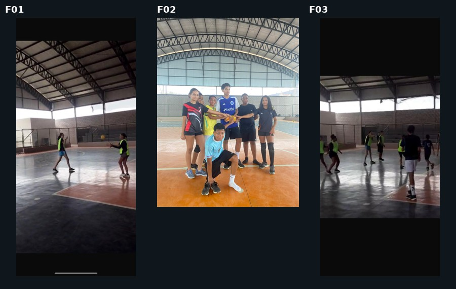
F01 e F03 são capturas de reprodução. F02 é a fotografia do grupo usada na montagem.

No V02, os trechos escolhidos no R2 funcionam como imagem de apoio. Todo o restante permanece como reserva, inclusive para futura seleção de fala após escuta.

---

## Decupagem completa: demais arquivos

| Arquivo / intervalo | O que se vê | Decisão |
| --- | --- | --- |
| V03  /  00:00-00:01.5 | Acomodação do enquadramento e participantes. | Fora. |
| V03  /  00:01.5-00:04.5 | Troca de bola e lançamento; jogadores próximos. | Melhor reserva do arquivo, em horizontal integral. |
| V03  /  00:04.5-00:08 | Ação se afasta; câmera acompanha. | Reserva secundária, pouca luz nos participantes. |
| V03  /  00:08-00:13.887 | Jogadores mais distantes, fundo claro e muita área vazia. | Fora dos dois Reels. |
| V04  /  00:00-00:04 | Pessoas caminham e se reposicionam. | 0-3 s no B02; restante fora. |
| V04  /  00:04-00:06.5 | Movimentação com participante de camisa azul. | 4-5,5 s no B06. |
| V04  /  00:06.5-00:11.5 | Plano mais aberto; ação pequena no quadro. | Fora: não alongar espera. |
| V04  /  00:11.5-00:15 | Ação mais próxima, passagem à frente da câmera. | 12,4-14,4 s no A03; usar janela quadrada. |
| V04  /  00:15-00:19.8 | Jogada perto da área, braços elevados e continuação. | 16,8-17,8 s no A05; 17,8-19,8 s no A06. |
| V04  /  00:19.8-00:25.6 | Ritmo desacelera; pessoas se aproximam. | Fora para não repetir a espera. |
| V04  /  00:25.6-00:31.25 | Grupo se reúne na quadra. | 25,6-28,1 s no A08; 27,5-31,25 s no B09. |
| V04  /  00:31.25-00:32.603 | Grupo ainda reunido; encerramento da gravação. | Fora, duração já suficiente. |
| V05  /  00:00-00:00.45 | Ação já em curso no início. | Fora do início da montagem. |
| V05  /  00:00.45-00:00.7 | Bola se aproxima da recepção. | A10, retorno visual para o início do R1. |
| V05  /  00:00.7-00:01.7 | Recepção, controle e preparação do passe. | A01, melhor abertura de ação. |
| V05  /  00:01.7-00:06.7 | Passe, corrida e ação até o outro lado. | A02, preservar largura. |
| V05  /  00:06.7-00:09.5 | Ação termina, grupo se dispersa. | Fora para não perder ritmo. |
| V05  /  00:09.5-00:11.723 | Pessoas caminhando, intervalo entre movimentos. | Fora. |

### Fotos: usar, recortar ou descartar

**F01:** captura de tela com passe e muito teto. Se fosse necessária, a área útil aproximada seria x=0, y=114, largura=592, altura=1052; removeria barras e interface. Mesmo assim, é menos útil que os vídeos. **Decisão:** não usar.

**F03:** captura mais escura e com grandes áreas pretas; a área útil aproximada fica entre y=285 e y=997. Não é uma fotografia vertical limpa. **Decisão:** não usar, nem como fundo de capa.

**F02:** usar no começo do R2 como detalhe das mãos e nos fechamentos como grupo. A embalagem amarela é visível; não identificá-la como troféu, prêmio oficial ou patrocínio. A foto comprova um registro coletivo, não um resultado esportivo.

---

## Como transformar horizontal em vertical

Projeto de referência: **1080 x 1920, 9:16, 30 fps**. As coordenadas de recorte nas fichas usam o arquivo original: origem no canto superior esquerdo, x para a direita e y para baixo. Cx/Cy são o centro do recorte; L/A são largura e altura. Não são percentuais.

| Modo | Dimensão visível na tela | Quando usar / planos |
| --- | --- | --- |
| P | 1080 x 1920, tela cheia | Gestos individuais em 720p: A01, A05 e A10. |
| C | 1080 x 1080, topo em y=420 | A03 e os bastidores A07/B07/B08. Dá mais espaço lateral que 9:16. |
| J | 1080 x 864, topo em y=528 | A04, A08, B02, B06 e B09. Grupos e bola em área mais ampla. |
| H | Largura 1080; altura proporcional; centro em y=960 | A02/A06: 607,5 px de altura. B03/B04/B05: aproximadamente 602,3 px. Preserva toda a fonte. |
| F | 1080 x 1920 | A09 e B10. Recorte central da foto, sem remover rostos. |
| D | 1080 x 864, topo em y=528 | B01. Detalhe da fotografia. Usar máscara retangular conforme a receita abaixo. |

### Fundo desfocado: receita única

Nos modos C, J, H e D, duplicar o mesmo trecho com os mesmos cortes e velocidade. A cópia inferior preenche 1080 x 1920 pelo centro, recebe Desfoque/Blur com intensidade 40 na escala 0-100 e fica sob uma camada preta de 60% de opacidade. A imagem principal fica nítida. Não usar remoção de fundo de pessoas; apenas uma duplicação da imagem inteira.

A base segue o movimento original do clipe, sem keyframes adicionais. Não deixar o efeito Blur agir na faixa superior nem aplicar nitidez no fundo. As referências mostram a composição geométrica; o desenho exato do desfoque varia conforme a versão do aplicativo.

### Converter recorte em escala e posição

Primeiro ajuste o clipe para que sua **largura inteira** ocupe exatamente 1080 px e fique centralizado. Esse tamanho é a referência de 100%. Se o campo Escala exibir outro número nesse estado, multiplique esse número por E/100, em vez de digitar E diretamente.

**E = 100 × largura original / L.**
**X = (largura original / 2 − Cx) × 1080 / L.**
**Y = (altura original / 2 − Cy) × 1080 / L.**
X e Y são deslocamentos em pixels em relação ao centro da tela, com y positivo para baixo. As tabelas de keyframes já trazem esses resultados.

Exemplo A01 no começo: fonte 1280 x 720, centro (320, 360), recorte 405 x 720. E=316,05%, X=+853,3 px e Y=0. O conteúdo visível da fonte começa em x=117,5. Mover a imagem para a direita traz a parte esquerda da fonte para o centro da composição.

### Keyframes e a foto de detalhe

Nos vídeos, animar posição e escala com interpolação linear. No último ponto de cada ficha, usar o último quadro do clipe, 1/30 s antes da saída da timeline. No B01, o zoom sobre a foto exige uma máscara retangular fixa de 1080 x 864 centralizada em (540,960), sem arredondamento e sem suavização de borda; ela impede que o resto da fotografia cubra o fundo.

O CapCut permite animar posição e escala por keyframes. Referência: https://www.capcut.com/resource/how-to-add-keyframes-in-capcut | Fundo com cópia desfocada: https://www.capcut.com/resource/how-to-blur-videos-in-capcut

---

## R1: O ritmo da quadra

**24 s | 10 planos | ação e compartilhamento.** Gancho de recepção em câmera lenta, expansão para mostrar a corrida, alternância de escalas e fechamento com pessoas. A pergunta final convida o público a pensar em alguém para jogar; o último meio segundo prepara o retorno à abertura.

O arco usa movimento → interação → memória. Os planos A01/A02 e A05/A06 preservam continuidade real dentro do mesmo arquivo. Os demais são uma montagem de momentos; não representam uma sequência única de pontos nem um resumo de placar.

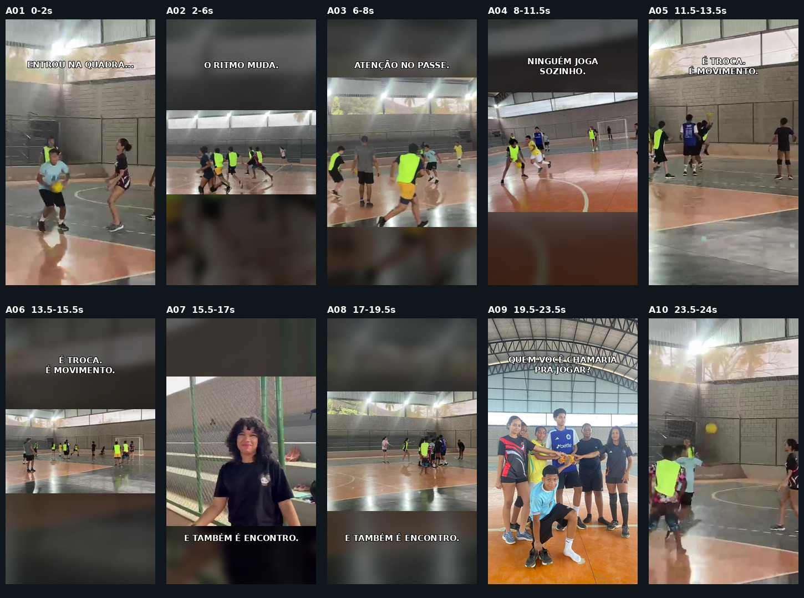
Referência de composição: um quadro do meio de cada plano. Consultar as fichas para entrada, saída e movimento.

Retenção é uma hipótese de edição, não uma garantia de alcance. O ganho pretendido vem de ação legível, mudanças de escala e uma pergunta específica. Não há métricas desta publicação para prever resultados.

---

## R1: timeline e textos

| Plano | Timeline IN → OUT | Fonte | Fonte IN → OUT | Duração | Veloc. |
| --- | --- | --- | --- | --- | --- |
| A01 | 00:00.000 → 00:02.000 | V05 | 00:00.700 → 00:01.700 | 2 s | 0.5x |
| A02 | 00:02.000 → 00:06.000 | V05 | 00:01.700 → 00:06.700 | 4 s | 1.25x |
| A03 | 00:06.000 → 00:08.000 | V04 | 00:12.400 → 00:14.400 | 2 s | 1x |
| A04 | 00:08.000 → 00:11.500 | V01 | 00:22.500 → 00:26.000 | 3.5 s | 1x |
| A05 | 00:11.500 → 00:13.500 | V04 | 00:16.800 → 00:17.800 | 2 s | 0.5x |
| A06 | 00:13.500 → 00:15.500 | V04 | 00:17.800 → 00:19.800 | 2 s | 1x |
| A07 | 00:15.500 → 00:17.000 | V01 | 01:12.250 → 01:13.750 | 1.5 s | 1x |
| A08 | 00:17.000 → 00:19.500 | V04 | 00:25.600 → 00:28.100 | 2.5 s | 1x |
| A09 | 00:19.500 → 00:23.500 | F02 | Foto | 4 s | - |
| A10 | 00:23.500 → 00:24.000 | V05 | 00:00.450 → 00:00.700 | 0.5 s | 0.5x |

OUT é exclusivo. Em 00:02.000, por exemplo, o plano que termina ali já cedeu lugar ao próximo. Timecode MM:SS:FF nas fichas usa 30 fps; o último plano deve fechar em 00:24:00.

| Texto: timeline IN → OUT | Conteúdo exato | Centro em px |
| --- | --- | --- |
| 00:00.000 → 00:02.000 | ENTROU NA QUADRA... | (540, 330) |
| 00:02.000 → 00:06.000 | O RITMO MUDA. | (540, 330) |
| 00:06.000 → 00:08.000 | ATENÇÃO NO PASSE. | (540, 330) |
| 00:08.000 → 00:11.500 | NINGUÉM JOGA SOZINHO. | (540, 330) |
| 00:11.500 → 00:15.500 | É TROCA. É MOVIMENTO. | (540, 330) |
| 00:15.500 → 00:19.500 | E TAMBÉM É ENCONTRO. | (540, 1580) |
| 00:19.500 → 00:23.500 | QUEM VOCÊ CHAMARIA PRA JOGAR? | (540, 330) |

As quebras de linha acima são intencionais. Fonte DejaVu Sans Bold, branca; tamanho 60 px em tela 1080 x 1920. Largura máxima 840 px, alinhamento central, contorno preto de 2 px. Sem animação de entrada/saída e sem efeitos de palavra. SRT carrega tempo e texto; posição, fonte e estilo são aplicados depois da importação.

---

## A01 | V05 | Vertical cheio

WhatsApp Video 2026-09-04 at 20.06.28.mp4

| Timeline | Duração final | Fonte | Velocidade |
| --- | --- | --- | --- |
| 00:00.000 → 00:02.000 00:00:00 → 00:02:00 | 2 s / 60 quadros | 00:00.700 → 00:01.700 | 0.5x constante |

**Conteúdo:** Recepção da bola pelo participante de camisa azul-clara. **Função:** Abrir com bola no ar e gesto legível; pequena câmera lenta para o olho localizar a ação.

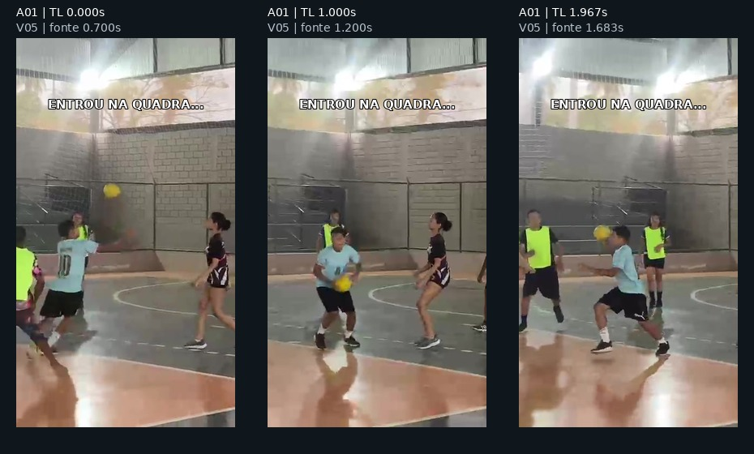
Início, meio e último quadro da composição proposta. A nitidez final continua limitada pela fonte.

| Keyframe na timeline | Cx; Cy na fonte | Recorte L x A | E referência | X; Y na tela |
| --- | --- | --- | --- | --- |
| 00:00.000 | 320.0; 360.0 | 405.0 x 720.0 | 316.05% | +853.3; +0.0 |
| 00:00.500 | 315.0; 360.0 | 405.0 x 720.0 | 316.05% | +866.7; +0.0 |
| 00:01.000 | 420.0; 360.0 | 405.0 x 720.0 | 316.05% | +586.7; +0.0 |
| 00:01.500 | 455.0; 360.0 | 405.0 x 720.0 | 316.05% | +493.3; +0.0 |
| 00:01.967 | 430.0; 360.0 | 405.0 x 720.0 | 316.05% | +560.0; +0.0 |

**Texto neste plano:** 00:00.000–00:02.000: ENTROU NA QUADRA...

**Transição:** Corte seco, 0 s. **Áudio:** Áudio original: 0% / mudo. A base R1 continua sem cortes nesta passagem.

**Execução:** Manter bola, cabeça e mãos. Não usar zoom além do recorte indicado. A saída em 1,700 s conecta ao A02.

C/P/F não usam máscara animada. No modo D, aplicar máscara retangular fixa conforme a receita. Nos demais, a tela vertical limita as laterais. Correção de cor por arquivo conforme a tabela de acabamento; estabilização desligada.

---

## A02 | V05 | Horizontal integral

WhatsApp Video 2026-09-04 at 20.06.28.mp4

| Timeline | Duração final | Fonte | Velocidade |
| --- | --- | --- | --- |
| 00:02.000 → 00:06.000 00:02:00 → 00:06:00 | 4 s / 120 quadros | 00:01.700 → 00:06.700 | 1.25x constante |

**Conteúdo:** Passe, corrida coletiva e deslocamento até o outro lado da quadra. **Função:** Dar continuidade à recepção e mostrar o percurso, com ritmo mais rápido.

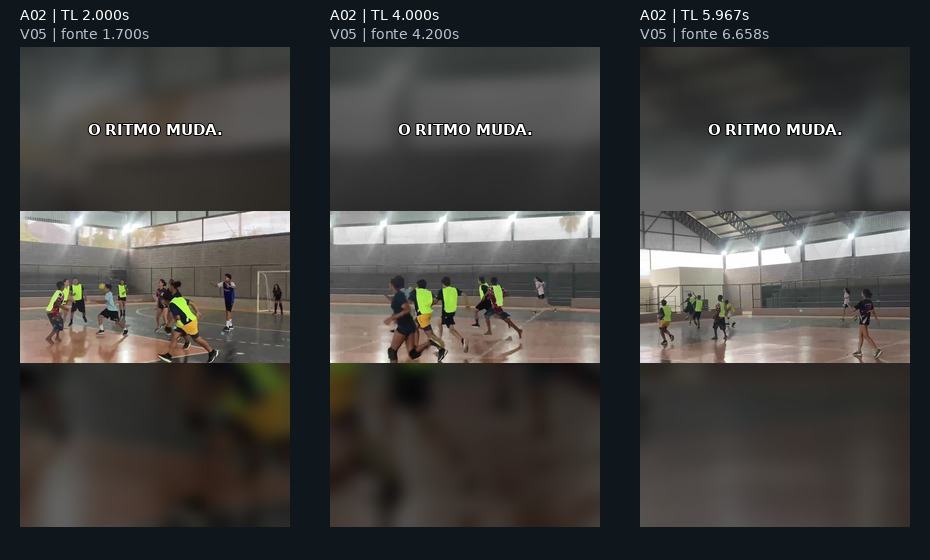
Início, meio e último quadro da composição proposta. A nitidez final continua limitada pela fonte.

| Keyframe na timeline | Cx; Cy na fonte | Recorte L x A | E referência | X; Y na tela |
| --- | --- | --- | --- | --- |
| 00:02.000 | 640.0; 360.0 | 1280.0 x 720.0 | 100.00% | +0.0; +0.0 |
| 00:05.967 | 640.0; 360.0 | 1280.0 x 720.0 | 100.00% | +0.0; +0.0 |

**Texto neste plano:** 00:02.000–00:06.000: O RITMO MUDA.

**Transição:** Corte seco, 0 s. **Áudio:** Áudio original: 0% / mudo. A base R1 continua sem cortes nesta passagem.

**Execução:** Preservar toda a largura. A bola cruza uma distância que o recorte vertical não comporta. Não escrever gol, ponto ou vitória.

C/P/F não usam máscara animada. No modo D, aplicar máscara retangular fixa conforme a receita. Nos demais, a tela vertical limita as laterais. Correção de cor por arquivo conforme a tabela de acabamento; estabilização desligada.

---

## A03 | V04 | Janela quadrada

WhatsApp Video 2026-09-04 at 20.06.28 (1).mp4

| Timeline | Duração final | Fonte | Velocidade |
| --- | --- | --- | --- |
| 00:06.000 → 00:08.000 00:06:00 → 00:08:00 | 2 s / 60 quadros | 00:12.400 → 00:14.400 | 1x constante |

**Conteúdo:** Participantes próximos disputam espaço e movimentam a bola. **Função:** Trocar o ângulo e aproximar a ação sem ampliação extrema.

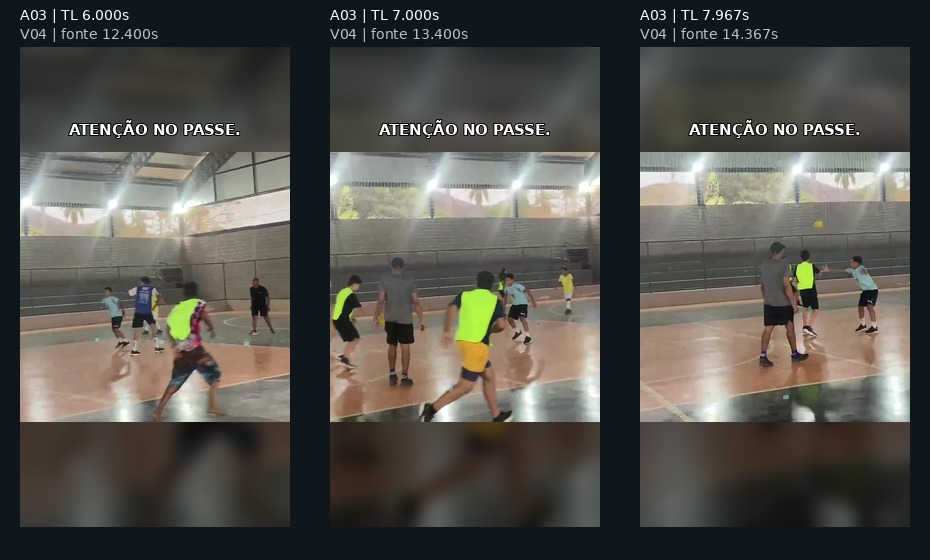
Início, meio e último quadro da composição proposta. A nitidez final continua limitada pela fonte.

| Keyframe na timeline | Cx; Cy na fonte | Recorte L x A | E referência | X; Y na tela |
| --- | --- | --- | --- | --- |
| 00:06.000 | 625.0; 360.0 | 720.0 x 720.0 | 177.78% | +22.5; +0.0 |
| 00:07.000 | 650.0; 360.0 | 720.0 x 720.0 | 177.78% | -15.0; +0.0 |
| 00:07.967 | 655.0; 360.0 | 720.0 x 720.0 | 177.78% | -22.5; +0.0 |

**Texto neste plano:** 00:06.000–00:08.000: ATENÇÃO NO PASSE.

**Transição:** Corte seco, 0 s. **Áudio:** Áudio original: 0% / mudo. A base R1 continua sem cortes nesta passagem.

**Execução:** Janela quadrada: o teste em 9:16 fechava demais a jogada. Manter os jogadores próximos e a bola; não ativar rastreamento automático.

C/P/F não usam máscara animada. No modo D, aplicar máscara retangular fixa conforme a receita. Nos demais, a tela vertical limita as laterais. Correção de cor por arquivo conforme a tabela de acabamento; estabilização desligada.

---

## A04 | V01 | Janela 5:4

WhatsApp Video 2026-09-04 at 09.21.35 (1).mp4

| Timeline | Duração final | Fonte | Velocidade |
| --- | --- | --- | --- |
| 00:08.000 → 00:11.500 00:08:00 → 00:11:15 | 3.5 s / 105 quadros | 00:22.500 → 00:26.000 | 1x constante |

**Conteúdo:** Participante de colete segura a bola, encara a marcação e a troca acontece entre os jogadores próximos. **Função:** Sustentar uma pequena sequência completa: observar, decidir, passar.

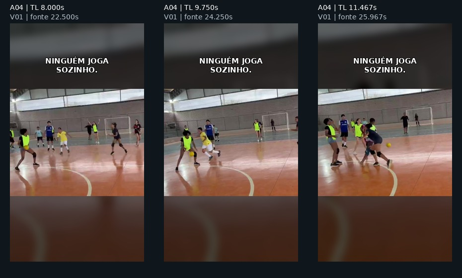
Início, meio e último quadro da composição proposta. A nitidez final continua limitada pela fonte.

| Keyframe na timeline | Cx; Cy na fonte | Recorte L x A | E referência | X; Y na tela |
| --- | --- | --- | --- | --- |
| 00:08.000 | 290.0; 232.0 | 580.0 x 464.0 | 143.45% | +234.6; +0.0 |
| 00:11.467 | 290.0; 232.0 | 580.0 x 464.0 | 143.45% | +234.6; +0.0 |

**Texto neste plano:** 00:08.000–00:11.500: NINGUÉM JOGA / SOZINHO.

**Transição:** Corte seco, 0 s. **Áudio:** Áudio original: 0% / mudo. A base R1 continua sem cortes nesta passagem.

**Execução:** Janela alinhada à esquerda da fonte (x inicial 0). Não cortar a bola junto à borda esquerda nem simular câmera lenta em 30 fps.

C/P/F não usam máscara animada. No modo D, aplicar máscara retangular fixa conforme a receita. Nos demais, a tela vertical limita as laterais. Correção de cor por arquivo conforme a tabela de acabamento; estabilização desligada.

---

## A05 | V04 | Vertical cheio

WhatsApp Video 2026-09-04 at 20.06.28 (1).mp4

| Timeline | Duração final | Fonte | Velocidade |
| --- | --- | --- | --- |
| 00:11.500 → 00:13.500 00:11:15 → 00:13:15 | 2 s / 60 quadros | 00:16.800 → 00:17.800 | 0.5x constante |

**Conteúdo:** Ação e elevação dos braços perto da área; participantes convergem para a jogada. **Função:** Criar uma pausa curta dentro do ritmo acelerado.

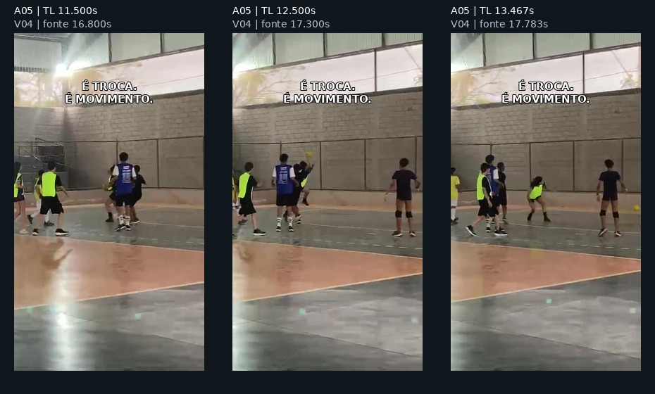
Início, meio e último quadro da composição proposta. A nitidez final continua limitada pela fonte.

| Keyframe na timeline | Cx; Cy na fonte | Recorte L x A | E referência | X; Y na tela |
| --- | --- | --- | --- | --- |
| 00:11.500 | 905.0; 360.0 | 405.0 x 720.0 | 316.05% | -706.7; +0.0 |
| 00:12.500 | 910.0; 360.0 | 405.0 x 720.0 | 316.05% | -720.0; +0.0 |
| 00:13.467 | 820.0; 360.0 | 405.0 x 720.0 | 316.05% | -480.0; +0.0 |

**Texto neste plano:** 00:11.500–00:13.500: É TROCA. / É MOVIMENTO.

**Transição:** Corte seco, 0 s. **Áudio:** Áudio original: 0% / mudo. A base R1 continua sem cortes nesta passagem.

**Execução:** Recorte vertical sobre a ação junto à área. Não afirmar o resultado da jogada. Fluxo óptico desligado.

C/P/F não usam máscara animada. No modo D, aplicar máscara retangular fixa conforme a receita. Nos demais, a tela vertical limita as laterais. Correção de cor por arquivo conforme a tabela de acabamento; estabilização desligada.

---

## A06 | V04 | Horizontal integral

WhatsApp Video 2026-09-04 at 20.06.28 (1).mp4

| Timeline | Duração final | Fonte | Velocidade |
| --- | --- | --- | --- |
| 00:13.500 → 00:15.500 00:13:15 → 00:15:15 | 2 s / 60 quadros | 00:17.800 → 00:19.800 | 1x constante |

**Conteúdo:** Continuação da movimentação junto à área em plano aberto. **Função:** Restituir o espaço e concluir a sequência anterior.

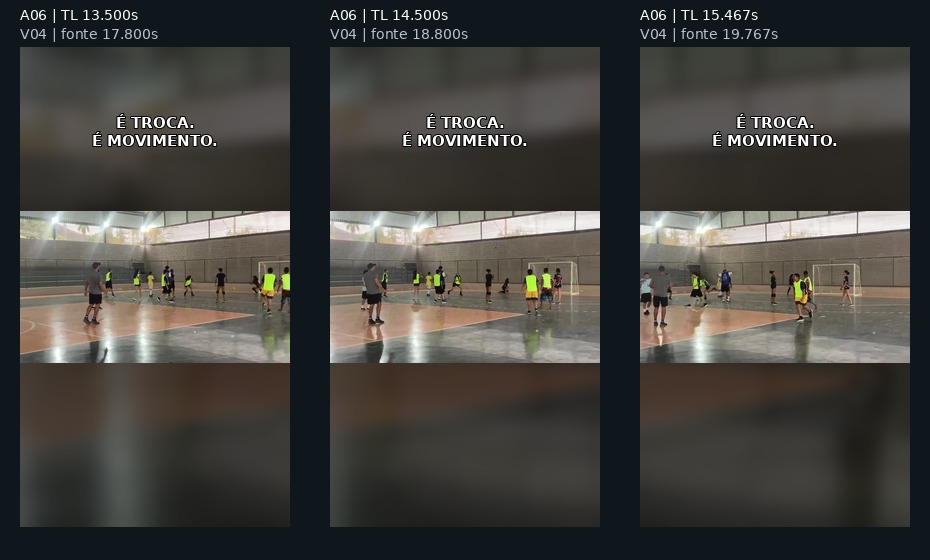
Início, meio e último quadro da composição proposta. A nitidez final continua limitada pela fonte.

| Keyframe na timeline | Cx; Cy na fonte | Recorte L x A | E referência | X; Y na tela |
| --- | --- | --- | --- | --- |
| 00:13.500 | 640.0; 360.0 | 1280.0 x 720.0 | 100.00% | +0.0; +0.0 |
| 00:15.467 | 640.0; 360.0 | 1280.0 x 720.0 | 100.00% | +0.0; +0.0 |

**Texto neste plano:** 00:13.500–00:15.500: É TROCA. / É MOVIMENTO.

**Transição:** Corte seco, 0 s. **Áudio:** Áudio original: 0% / mudo. A base R1 continua sem cortes nesta passagem.

**Execução:** Voltar para 1x no corte. Preservar a relação espacial com a trave; não adicionar placar nem efeito sonoro de gol.

C/P/F não usam máscara animada. No modo D, aplicar máscara retangular fixa conforme a receita. Nos demais, a tela vertical limita as laterais. Correção de cor por arquivo conforme a tabela de acabamento; estabilização desligada.

---

## A07 | V01 | Janela quadrada

WhatsApp Video 2026-09-04 at 09.21.35 (1).mp4

| Timeline | Duração final | Fonte | Velocidade |
| --- | --- | --- | --- |
| 00:15.500 → 00:17.000 00:15:15 → 00:17:00 | 1.5 s / 45 quadros | 01:12.250 → 01:13.750 | 1x constante |

**Conteúdo:** Participante junto à arquibancada olha para a câmera, sorri e acena. **Função:** Interromper a repetição de lances com um momento humano.

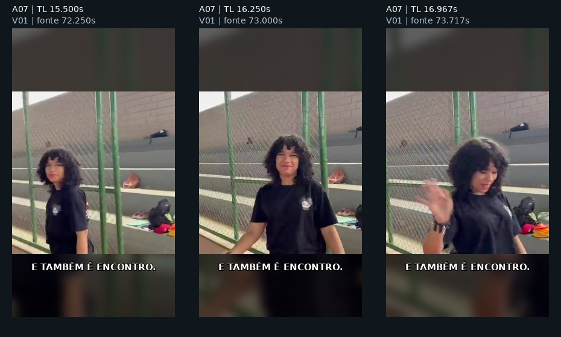
Início, meio e último quadro da composição proposta. A nitidez final continua limitada pela fonte.

| Keyframe na timeline | Cx; Cy na fonte | Recorte L x A | E referência | X; Y na tela |
| --- | --- | --- | --- | --- |
| 00:15.500 | 415.0; 232.0 | 464.0 x 464.0 | 179.31% | +2.3; +0.0 |
| 00:16.000 | 390.0; 232.0 | 464.0 x 464.0 | 179.31% | +60.5; +0.0 |
| 00:16.500 | 458.0; 232.0 | 464.0 x 464.0 | 179.31% | -97.8; +0.0 |
| 00:16.967 | 550.0; 232.0 | 464.0 x 464.0 | 179.31% | -311.9; +0.0 |

**Texto neste plano:** 00:15.500–00:17.000: E TAMBÉM É ENCONTRO.

**Transição:** Corte seco, 0 s. **Áudio:** Áudio original: 0% / mudo. A base R1 continua sem cortes nesta passagem.

**Execução:** Usar janela quadrada, com mão e rosto inteiros. Texto fica abaixo da janela. Cortar antes da virada da câmera.

C/P/F não usam máscara animada. No modo D, aplicar máscara retangular fixa conforme a receita. Nos demais, a tela vertical limita as laterais. Correção de cor por arquivo conforme a tabela de acabamento; estabilização desligada.

---

## A08 | V04 | Janela 5:4

WhatsApp Video 2026-09-04 at 20.06.28 (1).mp4

| Timeline | Duração final | Fonte | Velocidade |
| --- | --- | --- | --- |
| 00:17.000 → 00:19.500 00:17:00 → 00:19:15 | 2.5 s / 75 quadros | 00:25.600 → 00:28.100 | 1x constante |

**Conteúdo:** Participantes se aproximam e se reúnem na quadra. **Função:** Fazer a ponte entre o movimento esportivo e o registro do grupo.

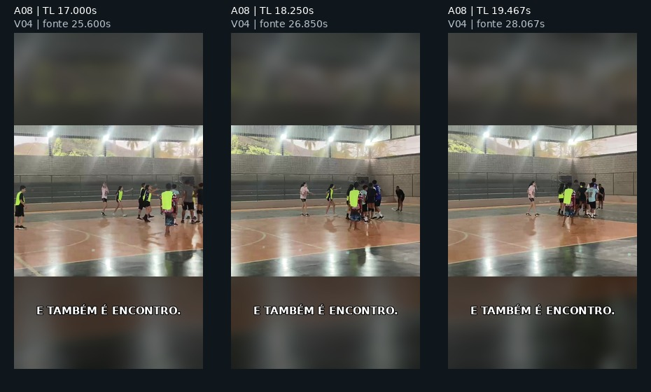
Início, meio e último quadro da composição proposta. A nitidez final continua limitada pela fonte.

| Keyframe na timeline | Cx; Cy na fonte | Recorte L x A | E referência | X; Y na tela |
| --- | --- | --- | --- | --- |
| 00:17.000 | 740.0; 360.0 | 900.0 x 720.0 | 142.22% | -120.0; +0.0 |
| 00:18.250 | 730.0; 360.0 | 900.0 x 720.0 | 142.22% | -108.0; +0.0 |
| 00:19.467 | 620.0; 360.0 | 900.0 x 720.0 | 142.22% | +24.0; +0.0 |

**Texto neste plano:** 00:17.000–00:19.500: E TAMBÉM É ENCONTRO.

**Transição:** Corte seco, 0 s. **Áudio:** Áudio original: 0% / mudo. A base R1 continua sem cortes nesta passagem.

**Execução:** É uma reunião visível, sem atribuir premiação ou comemoração de vitória. Não duplicar este plano como se fosse outro momento.

C/P/F não usam máscara animada. No modo D, aplicar máscara retangular fixa conforme a receita. Nos demais, a tela vertical limita as laterais. Correção de cor por arquivo conforme a tabela de acabamento; estabilização desligada.

---

## A09 | F02 | Foto vertical do grupo

WhatsApp Image 2026-09-04 at 09.21.36 (2).jpeg

| Timeline | Duração final | Fonte | Velocidade |
| --- | --- | --- | --- |
| 00:19.500 → 00:23.500 00:19:15 → 00:23:15 | 4 s / 120 quadros | Fotografia estática | Não se aplica |

**Conteúdo:** Foto do grupo com as mãos reunidas sobre um objeto/embalagem. **Função:** Fechamento coletivo e tempo de leitura da pergunta.

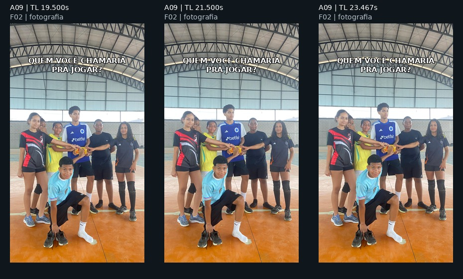
Início, meio e último quadro da composição proposta. A nitidez final continua limitada pela fonte.

| Keyframe na timeline | Cx; Cy na fonte | Recorte L x A | E referência | X; Y na tela |
| --- | --- | --- | --- | --- |
| 00:19.500 | 1512.0; 2016.0 | 2268.0 x 4032.0 | 133.33% | +0.0; +0.0 |
| 00:23.467 | 1512.0; 2054.8 | 2224.3 x 3954.3 | 135.95% | +0.0; -18.8 |

**Texto neste plano:** 00:19.500–00:23.500: QUEM VOCÊ CHAMARIA / PRA JOGAR?

**Transição:** Corte seco, 0 s. **Áudio:** Áudio original: 0% / mudo. A base R1 continua sem cortes nesta passagem.

**Execução:** A aproximação é de aproximadamente 2%. Preservar todos os rostos. Não chamar o objeto de troféu nem apresentar o grupo como campeão.

C/P/F não usam máscara animada. No modo D, aplicar máscara retangular fixa conforme a receita. Nos demais, a tela vertical limita as laterais. Correção de cor por arquivo conforme a tabela de acabamento; estabilização desligada.

---

## A10 | V05 | Vertical cheio

WhatsApp Video 2026-09-04 at 20.06.28.mp4

| Timeline | Duração final | Fonte | Velocidade |
| --- | --- | --- | --- |
| 00:23.500 → 00:24.000 00:23:15 → 00:24:00 | 0.5 s / 15 quadros | 00:00.450 → 00:00.700 | 0.5x constante |

**Conteúdo:** Fração do movimento imediatamente anterior à recepção do primeiro plano. **Função:** Preparar o retorno à abertura quando o Reel repetir.

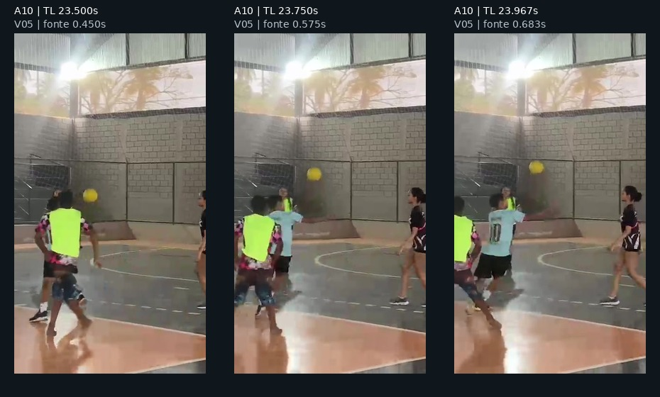
Início, meio e último quadro da composição proposta. A nitidez final continua limitada pela fonte.

| Keyframe na timeline | Cx; Cy na fonte | Recorte L x A | E referência | X; Y na tela |
| --- | --- | --- | --- | --- |
| 00:23.500 | 290.0; 360.0 | 405.0 x 720.0 | 316.05% | +933.3; +0.0 |
| 00:23.967 | 320.0; 360.0 | 405.0 x 720.0 | 316.05% | +853.3; +0.0 |

**Texto neste plano:** Nenhum.

**Transição:** Corte seco, 0 s. **Áudio:** Áudio original: 0% / mudo. A base R1 continua sem cortes nesta passagem.

**Execução:** Sem texto. O último tempo-fonte termina exatamente onde A01 começa. O salto entre foto e ação é intencional; o encaixe final/início mantém direção e escala.

C/P/F não usam máscara animada. No modo D, aplicar máscara retangular fixa conforme a receita. Nos demais, a tela vertical limita as laterais. Correção de cor por arquivo conforme a tabela de acabamento; estabilização desligada.

---

## R2: O que fica depois do jogo

**30 s | 10 planos | memória e identificação.** Abrir no detalhe das mãos, perguntar o que permanece e responder com encontros, risadas, pequenos gestos e o retrato do grupo. O ritmo de leitura é mais calmo; a foto final revela o conjunto que não aparecia inteiro no começo.

A trilha é mais leve e os cortes deixam gestos respirarem. A presença das pessoas diante da câmera oferece contexto visual; seus textos não são falas atribuídas. O encerramento é uma conclusão afetiva, sem promessa de próxima edição, convite a inscrições ou identidade institucional inventada.

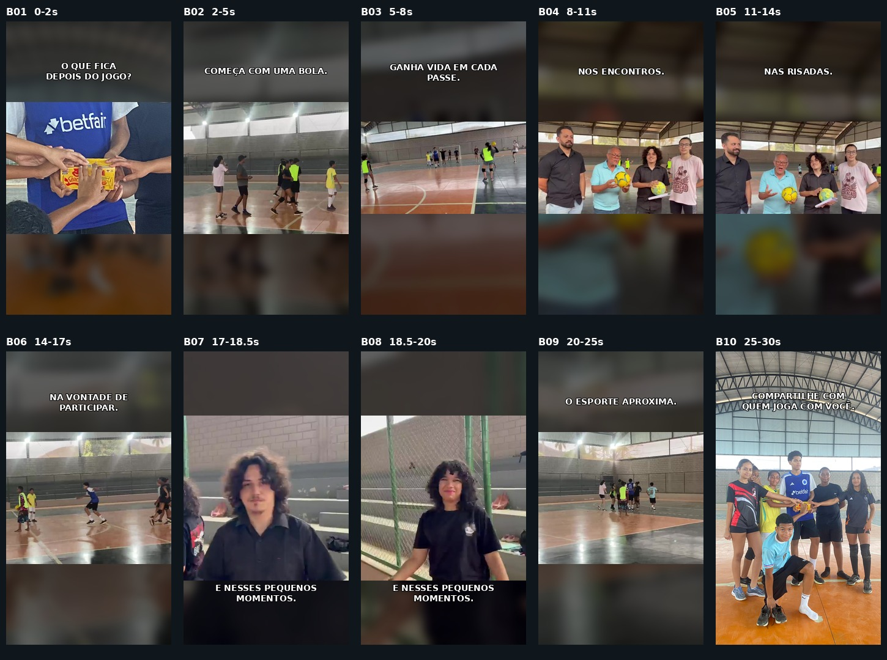
Referência de composição: um quadro do meio de cada plano. Consultar as fichas para entrada, saída e movimento.

Retenção é uma hipótese de edição, não uma garantia de alcance. O ganho pretendido vem de ação legível, mudanças de escala e uma pergunta específica. Não há métricas desta publicação para prever resultados.

---

## R2: timeline e textos

| Plano | Timeline IN → OUT | Fonte | Fonte IN → OUT | Duração | Veloc. |
| --- | --- | --- | --- | --- | --- |
| B01 | 00:00.000 → 00:02.000 | F02 | Foto | 2 s | - |
| B02 | 00:02.000 → 00:05.000 | V04 | 00:00.000 → 00:03.000 | 3 s | 1x |
| B03 | 00:05.000 → 00:08.000 | V01 | 00:14.500 → 00:17.500 | 3 s | 1x |
| B04 | 00:08.000 → 00:11.000 | V02 | 00:21.200 → 00:24.200 | 3 s | 1x |
| B05 | 00:11.000 → 00:14.000 | V02 | 00:35.200 → 00:38.200 | 3 s | 1x |
| B06 | 00:14.000 → 00:17.000 | V04 | 00:04.000 → 00:05.500 | 3 s | 0.5x |
| B07 | 00:17.000 → 00:18.500 | V01 | 01:10.300 → 01:11.800 | 1.5 s | 1x |
| B08 | 00:18.500 → 00:20.000 | V01 | 01:12.250 → 01:13.750 | 1.5 s | 1x |
| B09 | 00:20.000 → 00:25.000 | V04 | 00:27.500 → 00:31.250 | 5 s | 0.75x |
| B10 | 00:25.000 → 00:30.000 | F02 | Foto | 5 s | - |

OUT é exclusivo. Em 00:02.000, por exemplo, o plano que termina ali já cedeu lugar ao próximo. Timecode MM:SS:FF nas fichas usa 30 fps; o último plano deve fechar em 00:30:00.

| Texto: timeline IN → OUT | Conteúdo exato | Centro em px |
| --- | --- | --- |
| 00:00.000 → 00:02.000 | O QUE FICA DEPOIS DO JOGO? | (540, 330) |
| 00:02.000 → 00:05.000 | COMEÇA COM UMA BOLA. | (540, 330) |
| 00:05.000 → 00:08.000 | GANHA VIDA EM CADA PASSE. | (540, 330) |
| 00:08.000 → 00:11.000 | NOS ENCONTROS. | (540, 330) |
| 00:11.000 → 00:14.000 | NAS RISADAS. | (540, 330) |
| 00:14.000 → 00:17.000 | NA VONTADE DE PARTICIPAR. | (540, 330) |
| 00:17.000 → 00:20.000 | E NESSES PEQUENOS MOMENTOS. | (540, 1580) |
| 00:20.000 → 00:25.000 | O ESPORTE APROXIMA. | (540, 330) |
| 00:25.000 → 00:27.500 | AS HISTÓRIAS FICAM. | (540, 330) |
| 00:27.500 → 00:30.000 | COMPARTILHE COM QUEM JOGA COM VOCÊ. | (540, 330) |

As quebras de linha acima são intencionais. Fonte DejaVu Sans Bold, branca; tamanho 56 px em tela 1080 x 1920. Largura máxima 840 px, alinhamento central, contorno preto de 2 px. Sem animação de entrada/saída e sem efeitos de palavra. SRT carrega tempo e texto; posição, fonte e estilo são aplicados depois da importação.

---

## B01 | F02 | Detalhe da foto em 5:4

WhatsApp Image 2026-09-04 at 09.21.36 (2).jpeg

| Timeline | Duração final | Fonte | Velocidade |
| --- | --- | --- | --- |
| 00:00.000 → 00:02.000 00:00:00 → 00:02:00 | 2 s / 60 quadros | Fotografia estática | Não se aplica |

**Conteúdo:** Detalhe das mãos reunidas no centro da fotografia. **Função:** Abrir uma pergunta visual e guardar a revelação do grupo para o final.

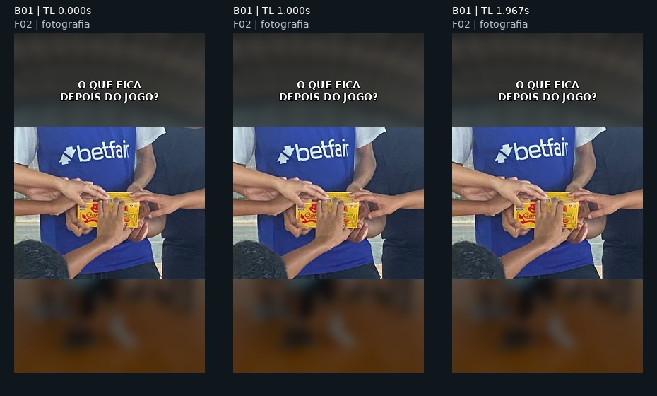
Início, meio e último quadro da composição proposta. A nitidez final continua limitada pela fonte.

| Keyframe na timeline | Cx; Cy na fonte | Recorte L x A | E referência | X; Y na tela |
| --- | --- | --- | --- | --- |
| 00:00.000 | 1580.0; 2120.0 | 625.0 x 500.0 | 483.84% | -117.5; -179.7 |
| 00:01.967 | 1580.0; 2120.0 | 600.0 x 480.0 | 504.00% | -122.4; -187.2 |

**Texto neste plano:** 00:00.000–00:02.000: O QUE FICA / DEPOIS DO JOGO?

**Transição:** Corte seco, 0 s. **Áudio:** Áudio original: 0% / mudo. A base R2 continua sem cortes nesta passagem.

**Execução:** Janela 1080 x 864. Este é um recorte de detalhe deliberado; não é a foto inteira. Não inventar significado para o objeto central.

C/P/F não usam máscara animada. No modo D, aplicar máscara retangular fixa conforme a receita. Nos demais, a tela vertical limita as laterais. Correção de cor por arquivo conforme a tabela de acabamento; estabilização desligada.

---

## B02 | V04 | Janela 5:4

WhatsApp Video 2026-09-04 at 20.06.28 (1).mp4

| Timeline | Duração final | Fonte | Velocidade |
| --- | --- | --- | --- |
| 00:02.000 → 00:05.000 00:02:00 → 00:05:00 | 3 s / 90 quadros | 00:00.000 → 00:03.000 | 1x constante |

**Conteúdo:** Participantes e pessoa de camiseta rosa circulam pela quadra. **Função:** Situar a convivência e a atividade compartilhada.

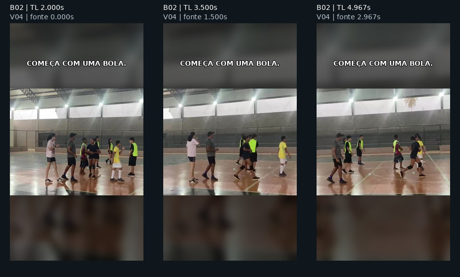
Início, meio e último quadro da composição proposta. A nitidez final continua limitada pela fonte.

| Keyframe na timeline | Cx; Cy na fonte | Recorte L x A | E referência | X; Y na tela |
| --- | --- | --- | --- | --- |
| 00:02.000 | 640.0; 360.0 | 900.0 x 720.0 | 142.22% | +0.0; +0.0 |
| 00:03.500 | 730.0; 360.0 | 900.0 x 720.0 | 142.22% | -108.0; +0.0 |
| 00:04.967 | 700.0; 360.0 | 900.0 x 720.0 | 142.22% | -72.0; +0.0 |

**Texto neste plano:** 00:02.000–00:05.000: COMEÇA COM UMA BOLA.

**Transição:** Corte seco, 0 s. **Áudio:** Áudio original: 0% / mudo. A base R2 continua sem cortes nesta passagem.

**Execução:** Evitar identificar cargos, instituição ou relação entre as pessoas. Não há confirmação desses dados no material visual.

C/P/F não usam máscara animada. No modo D, aplicar máscara retangular fixa conforme a receita. Nos demais, a tela vertical limita as laterais. Correção de cor por arquivo conforme a tabela de acabamento; estabilização desligada.

---

## B03 | V01 | Horizontal integral

WhatsApp Video 2026-09-04 at 09.21.35 (1).mp4

| Timeline | Duração final | Fonte | Velocidade |
| --- | --- | --- | --- |
| 00:05.000 → 00:08.000 00:05:00 → 00:08:00 | 3 s / 90 quadros | 00:14.500 → 00:17.500 | 1x constante |

**Conteúdo:** Recepção e lançamento da bola por participante de colete próximo à lateral. **Função:** Usar a troca de passes como ligação narrativa.

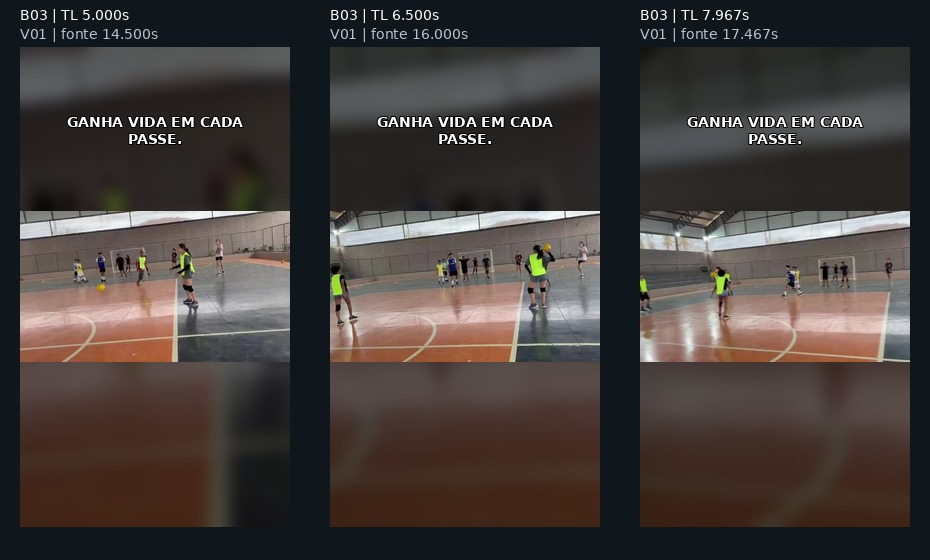
Início, meio e último quadro da composição proposta. A nitidez final continua limitada pela fonte.

| Keyframe na timeline | Cx; Cy na fonte | Recorte L x A | E referência | X; Y na tela |
| --- | --- | --- | --- | --- |
| 00:05.000 | 416.0; 232.0 | 832.0 x 464.0 | 100.00% | +0.0; +0.0 |
| 00:07.967 | 416.0; 232.0 | 832.0 x 464.0 | 100.00% | +0.0; +0.0 |

**Texto neste plano:** 00:05.000–00:08.000: GANHA VIDA EM CADA / PASSE.

**Transição:** Corte seco, 0 s. **Áudio:** Áudio original: 0% / mudo. A base R2 continua sem cortes nesta passagem.

**Execução:** Plano horizontal completo: a bola sobe e atravessa o enquadramento. A câmera já acompanha a ação; não somar panorâmica digital.

C/P/F não usam máscara animada. No modo D, aplicar máscara retangular fixa conforme a receita. Nos demais, a tela vertical limita as laterais. Correção de cor por arquivo conforme a tabela de acabamento; estabilização desligada.

---

## B04 | V02 | Horizontal integral

WhatsApp Video 2026-09-04 at 09.21.35.mp4

| Timeline | Duração final | Fonte | Velocidade |
| --- | --- | --- | --- |
| 00:08.000 → 00:11.000 00:08:00 → 00:11:00 | 3 s / 90 quadros | 00:21.200 → 00:24.200 | 1x constante |

**Conteúdo:** Quatro pessoas diante da câmera, duas com bolas; aparecem sorrisos e gestos. **Função:** Introduzir a presença de outras pessoas e a dimensão coletiva.

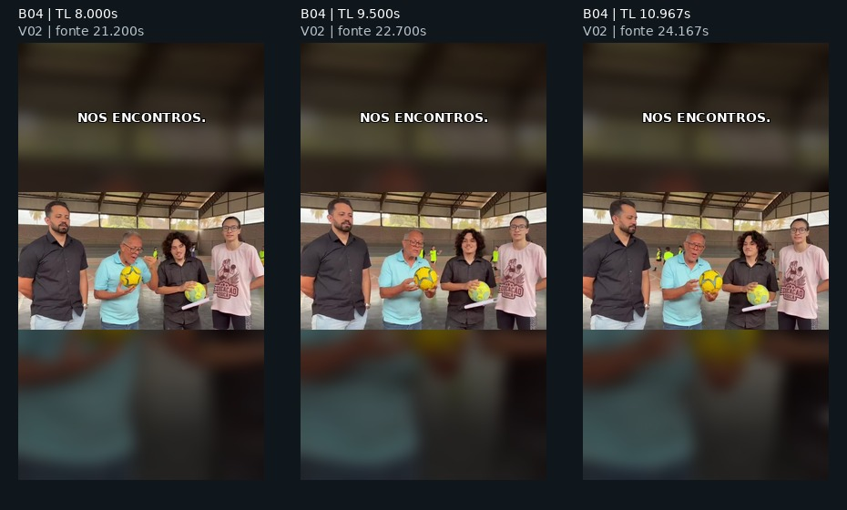
Início, meio e último quadro da composição proposta. A nitidez final continua limitada pela fonte.

| Keyframe na timeline | Cx; Cy na fonte | Recorte L x A | E referência | X; Y na tela |
| --- | --- | --- | --- | --- |
| 00:08.000 | 416.0; 232.0 | 832.0 x 464.0 | 100.00% | +0.0; +0.0 |
| 00:10.967 | 416.0; 232.0 | 832.0 x 464.0 | 100.00% | +0.0; +0.0 |

**Texto neste plano:** 00:08.000–00:11.000: NOS ENCONTROS.

**Transição:** Corte seco, 0 s. **Áudio:** Áudio original: 0% / mudo. A base R2 continua sem cortes nesta passagem.

**Execução:** Somente imagem de apoio, áudio mudo. O texto é editorial e aparece fora da imagem, sem aspas. Não tratá-lo como legenda da fala.

C/P/F não usam máscara animada. No modo D, aplicar máscara retangular fixa conforme a receita. Nos demais, a tela vertical limita as laterais. Correção de cor por arquivo conforme a tabela de acabamento; estabilização desligada.

---

## B05 | V02 | Horizontal integral

WhatsApp Video 2026-09-04 at 09.21.35.mp4

| Timeline | Duração final | Fonte | Velocidade |
| --- | --- | --- | --- |
| 00:11.000 → 00:14.000 00:11:00 → 00:14:00 | 3 s / 90 quadros | 00:35.200 → 00:38.200 | 1x constante |

**Conteúdo:** Troca de olhares e sorrisos entre as pessoas diante da câmera. **Função:** Dar uma pausa afetiva antes de voltar ao jogo.

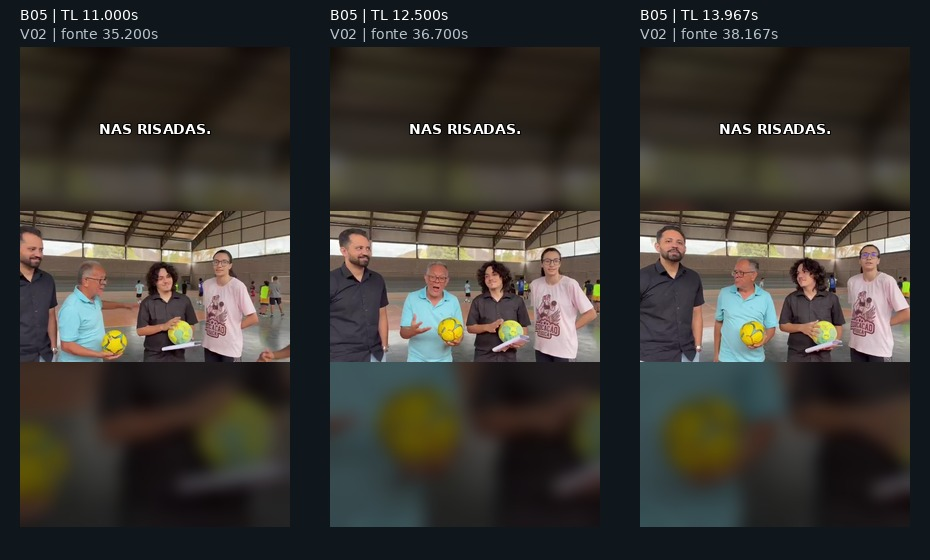
Início, meio e último quadro da composição proposta. A nitidez final continua limitada pela fonte.

| Keyframe na timeline | Cx; Cy na fonte | Recorte L x A | E referência | X; Y na tela |
| --- | --- | --- | --- | --- |
| 00:11.000 | 416.0; 232.0 | 832.0 x 464.0 | 100.00% | +0.0; +0.0 |
| 00:13.967 | 416.0; 232.0 | 832.0 x 464.0 | 100.00% | +0.0; +0.0 |

**Texto neste plano:** 00:11.000–00:14.000: NAS RISADAS.

**Transição:** Corte seco, 0 s. **Áudio:** Áudio original: 0% / mudo. A base R2 continua sem cortes nesta passagem.

**Execução:** Há salto temporal na mesma gravação; o texto muda no corte. Sem simular continuidade de depoimento e sem imitar a voz dos participantes.

C/P/F não usam máscara animada. No modo D, aplicar máscara retangular fixa conforme a receita. Nos demais, a tela vertical limita as laterais. Correção de cor por arquivo conforme a tabela de acabamento; estabilização desligada.

---

## B06 | V04 | Janela 5:4

WhatsApp Video 2026-09-04 at 20.06.28 (1).mp4

| Timeline | Duração final | Fonte | Velocidade |
| --- | --- | --- | --- |
| 00:14.000 → 00:17.000 00:14:00 → 00:17:00 | 3 s / 90 quadros | 00:04.000 → 00:05.500 | 0.5x constante |

**Conteúdo:** Participante de camisa azul recebe/acompanha a bola enquanto o grupo se movimenta. **Função:** Valorizar participação e atenção com uma câmera lenta possível na fonte.

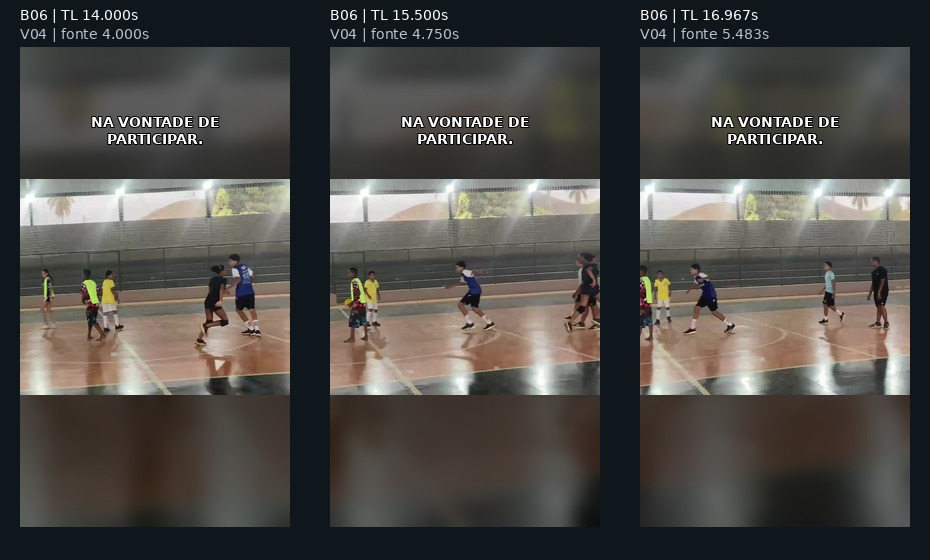
Início, meio e último quadro da composição proposta. A nitidez final continua limitada pela fonte.

| Keyframe na timeline | Cx; Cy na fonte | Recorte L x A | E referência | X; Y na tela |
| --- | --- | --- | --- | --- |
| 00:14.000 | 830.0; 360.0 | 900.0 x 720.0 | 142.22% | -228.0; +0.0 |
| 00:15.500 | 790.0; 360.0 | 900.0 x 720.0 | 142.22% | -180.0; +0.0 |
| 00:16.967 | 650.0; 360.0 | 900.0 x 720.0 | 142.22% | -12.0; +0.0 |

**Texto neste plano:** 00:14.000–00:17.000: NA VONTADE DE / PARTICIPAR.

**Transição:** Corte seco, 0 s. **Áudio:** Áudio original: 0% / mudo. A base R2 continua sem cortes nesta passagem.

**Execução:** 0,5x no vídeo de quase 60 fps; manter mãos e participantes próximos na janela. Sem interpolação por IA.

C/P/F não usam máscara animada. No modo D, aplicar máscara retangular fixa conforme a receita. Nos demais, a tela vertical limita as laterais. Correção de cor por arquivo conforme a tabela de acabamento; estabilização desligada.

---

## B07 | V01 | Janela quadrada

WhatsApp Video 2026-09-04 at 09.21.35 (1).mp4

| Timeline | Duração final | Fonte | Velocidade |
| --- | --- | --- | --- |
| 00:17.000 → 00:18.500 00:17:00 → 00:18:15 | 1.5 s / 45 quadros | 01:10.300 → 01:11.800 | 1x constante |

**Conteúdo:** Participante de camisa preta junto à arquibancada olha para a câmera e faz um gesto com a mão. **Função:** Trazer espontaneidade de bastidor.

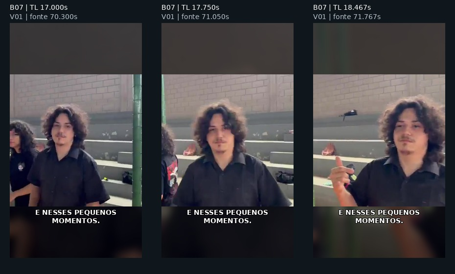
Início, meio e último quadro da composição proposta. A nitidez final continua limitada pela fonte.

| Keyframe na timeline | Cx; Cy na fonte | Recorte L x A | E referência | X; Y na tela |
| --- | --- | --- | --- | --- |
| 00:17.000 | 460.0; 232.0 | 464.0 x 464.0 | 179.31% | -102.4; +0.0 |
| 00:17.750 | 465.0; 232.0 | 464.0 x 464.0 | 179.31% | -114.1; +0.0 |
| 00:18.200 | 560.0; 232.0 | 464.0 x 464.0 | 179.31% | -335.2; +0.0 |
| 00:18.467 | 600.0; 232.0 | 464.0 x 464.0 | 179.31% | -428.3; +0.0 |

**Texto neste plano:** 00:17.000–00:18.500: E NESSES PEQUENOS / MOMENTOS.

**Transição:** Corte seco, 0 s. **Áudio:** Áudio original: 0% / mudo. A base R2 continua sem cortes nesta passagem.

**Execução:** Terminar antes de a câmera abandonar essa pessoa. Sem legenda de fala, sem nome ou função inventados.

C/P/F não usam máscara animada. No modo D, aplicar máscara retangular fixa conforme a receita. Nos demais, a tela vertical limita as laterais. Correção de cor por arquivo conforme a tabela de acabamento; estabilização desligada.

---

## B08 | V01 | Janela quadrada

WhatsApp Video 2026-09-04 at 09.21.35 (1).mp4

| Timeline | Duração final | Fonte | Velocidade |
| --- | --- | --- | --- |
| 00:18.500 → 00:20.000 00:18:15 → 00:20:00 | 1.5 s / 45 quadros | 01:12.250 → 01:13.750 | 1x constante |

**Conteúdo:** Olhar, sorriso e aceno de outra pessoa junto à arquibancada. **Função:** Completar a ideia de pequenos momentos que permanecem.

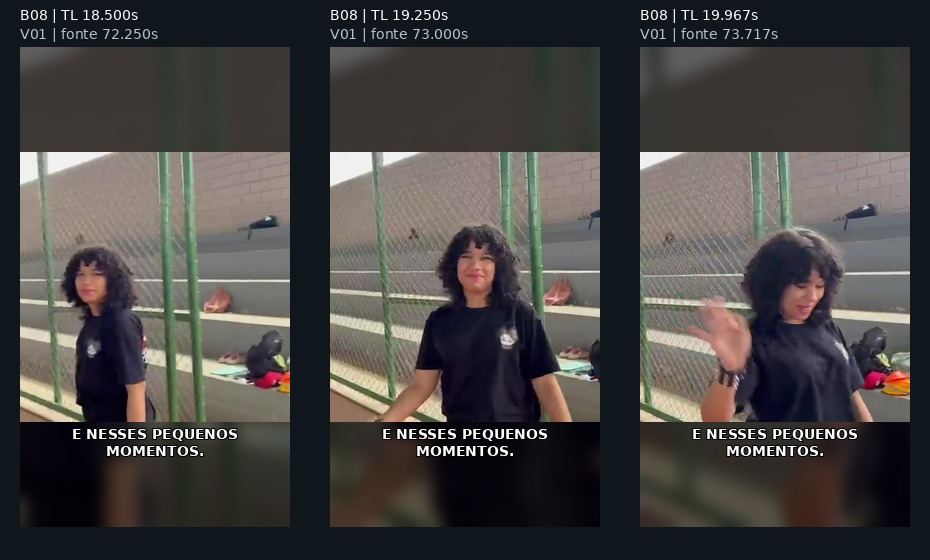
Início, meio e último quadro da composição proposta. A nitidez final continua limitada pela fonte.

| Keyframe na timeline | Cx; Cy na fonte | Recorte L x A | E referência | X; Y na tela |
| --- | --- | --- | --- | --- |
| 00:18.500 | 415.0; 232.0 | 464.0 x 464.0 | 179.31% | +2.3; +0.0 |
| 00:19.000 | 390.0; 232.0 | 464.0 x 464.0 | 179.31% | +60.5; +0.0 |
| 00:19.500 | 458.0; 232.0 | 464.0 x 464.0 | 179.31% | -97.8; +0.0 |
| 00:19.967 | 550.0; 232.0 | 464.0 x 464.0 | 179.31% | -311.9; +0.0 |

**Texto neste plano:** 00:18.500–00:20.000: E NESSES PEQUENOS / MOMENTOS.

**Transição:** Corte seco, 0 s. **Áudio:** Áudio original: 0% / mudo. A base R2 continua sem cortes nesta passagem.

**Execução:** Repete 1,5 s usados no Reel 1, agora com função narrativa. Janela quadrada preserva a mão; nenhuma câmera lenta.

C/P/F não usam máscara animada. No modo D, aplicar máscara retangular fixa conforme a receita. Nos demais, a tela vertical limita as laterais. Correção de cor por arquivo conforme a tabela de acabamento; estabilização desligada.

---

## B09 | V04 | Janela 5:4

WhatsApp Video 2026-09-04 at 20.06.28 (1).mp4

| Timeline | Duração final | Fonte | Velocidade |
| --- | --- | --- | --- |
| 00:20.000 → 00:25.000 00:20:00 → 00:25:00 | 5 s / 150 quadros | 00:27.500 → 00:31.250 | 0.75x constante |

**Conteúdo:** Grupo reunido na quadra; a câmera acomoda o conjunto. **Função:** Construir a passagem de pessoas em movimento para o retrato coletivo.

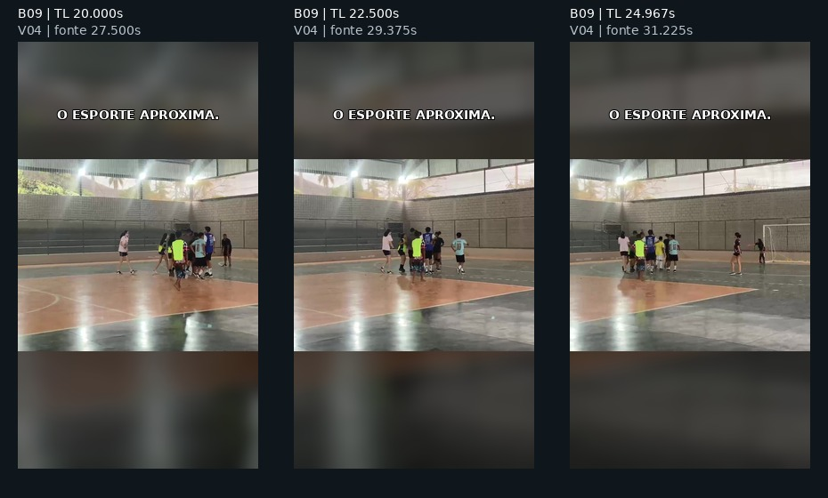
Início, meio e último quadro da composição proposta. A nitidez final continua limitada pela fonte.

| Keyframe na timeline | Cx; Cy na fonte | Recorte L x A | E referência | X; Y na tela |
| --- | --- | --- | --- | --- |
| 00:20.000 | 650.0; 360.0 | 900.0 x 720.0 | 142.22% | -12.0; +0.0 |
| 00:22.000 | 570.0; 360.0 | 900.0 x 720.0 | 142.22% | +84.0; +0.0 |
| 00:24.967 | 570.0; 360.0 | 900.0 x 720.0 | 142.22% | +84.0; +0.0 |

**Texto neste plano:** 00:20.000–00:25.000: O ESPORTE APROXIMA.

**Transição:** Corte seco, 0 s. **Áudio:** Áudio original: 0% / mudo. A base R2 continua sem cortes nesta passagem.

**Execução:** Câmera lenta moderada. O grupo fica visível durante cinco segundos; os textos sustentam a ideia de aproximação, sem alegar resultado esportivo.

C/P/F não usam máscara animada. No modo D, aplicar máscara retangular fixa conforme a receita. Nos demais, a tela vertical limita as laterais. Correção de cor por arquivo conforme a tabela de acabamento; estabilização desligada.

---

## B10 | F02 | Foto vertical do grupo

WhatsApp Image 2026-09-04 at 09.21.36 (2).jpeg

| Timeline | Duração final | Fonte | Velocidade |
| --- | --- | --- | --- |
| 00:25.000 → 00:30.000 00:25:00 → 00:30:00 | 5 s / 150 quadros | Fotografia estática | Não se aplica |

**Conteúdo:** Revelação da fotografia inteira em recorte vertical que mantém todos os rostos. **Função:** Responder à abertura: as pessoas e as histórias ficam.

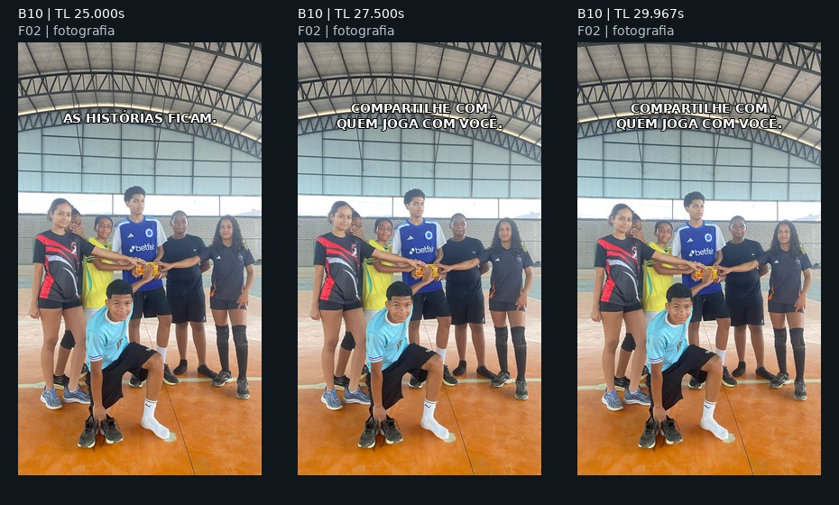
Início, meio e último quadro da composição proposta. A nitidez final continua limitada pela fonte.

| Keyframe na timeline | Cx; Cy na fonte | Recorte L x A | E referência | X; Y na tela |
| --- | --- | --- | --- | --- |
| 00:25.000 | 1512.0; 2054.8 | 2224.3 x 3954.3 | 135.95% | +0.0; -18.8 |
| 00:29.967 | 1512.0; 2016.0 | 2268.0 x 4032.0 | 133.33% | +0.0; +0.0 |

**Texto neste plano:** 00:25.000–00:27.500: AS HISTÓRIAS FICAM. | 00:27.500–00:30.000: COMPARTILHE COM / QUEM JOGA COM VOCÊ.

**Transição:** Entrada por opacidade, 0,200 s; usar congelamento do plano anterior sob a foto. **Áudio:** Áudio original: 0% / mudo. A base R2 continua sem cortes nesta passagem.

**Execução:** Zoom de saída suave de aproximadamente 2%. Exibir duas mensagens, com troca em 27,500 s. Dissolução de entrada especificada no manual, sem encurtar a timeline.

C/P/F não usam máscara animada. No modo D, aplicar máscara retangular fixa conforme a receita. Nos demais, a tela vertical limita as laterais. Correção de cor por arquivo conforme a tabela de acabamento; estabilização desligada.

---

## CapCut: montagem passo a passo

### 1. Preparar o projeto

Extraia o ZIP original para uma pasta de mídia e mantenha todos os nomes. Instale DejaVuSans-Bold.ttf da pasta fontes e reabra o CapCut. Crie dois projetos separados: R1_Ritmo_24s e R2_Encontro_30s. Defina a proporção 9:16, resolução de trabalho/saída 1080 x 1920 e 30 fps. Importe as oito mídias e as duas bases WAV. Não use template automático.

### 2. Cortar antes de posicionar

Em cada projeto, monte os planos na ordem A01-A10 ou B01-B10. Localize o IN na fonte, divida; localize o OUT, divida; retenha apenas esse trecho. Aplique a velocidade constante indicada e confira sua duração final. Só depois arraste para o IN da timeline. Não aplique velocidade ao arquivo inteiro antes de procurar os tempos-fonte, pois isso muda a referência dos cortes.

No caso de fotografia, ajuste diretamente sua duração na timeline. Desative edição por ondulação quando ela deslocar planos já posicionados. Faça a conferência por MM:SS:FF das fichas; amplie a timeline para ver quadros. Toda lacuna ou sobreposição é erro, exceto a composição de 6 quadros na entrada de B10, descrita adiante.

### 3. Montar as camadas

| Ordem, de baixo para cima | Conteúdo |
| --- | --- |
| V1 | Duplicata de fundo dos planos C/J/H/D, preenchendo a tela. Mesmo IN/OUT e mesma velocidade do plano principal. Blur apenas nesta faixa. |
| V2 | Cor preta cobrindo o quadro, 60% de opacidade, apenas durante os planos com fundo. |
| V3 | Imagem principal nítida, com os recortes e keyframes das fichas. Nos modos P e F, ocupa a tela toda. |
| V4 | Textos editoriais importados pelo SRT. Na entrada de B10, a foto pode usar uma faixa intermediária extra acima do congelamento. |
| A1 | R1_base_120bpm.wav ou R2_base_100bpm.wav, começando em zero. |
| Áudio dos vídeos | Volume zero em todas as instâncias, incluindo duplicatas. |

### 4. Aplicar o enquadramento

Ajuste a largura integral da fonte a 1080 px, centralize e registre a escala-base. Aplique E relativo a essa base e os deslocamentos X/Y. Use o losango de keyframe para posição e escala. Avance aos tempos de cada linha da ficha e insira o novo estado. A interpolação é linear; o último ponto fica no último quadro do plano. Para C/J/H, o vídeo principal conserva sua altura proporcional e fica centralizado verticalmente.

No B01, agrupe/transforme a foto dentro de uma composição e mantenha a máscara retangular de 1080 x 864 fixa em relação à tela; anime a imagem sob essa janela. O método evita que a ampliação da fotografia invada a região dos textos. O arquivo de referência mostra o recorte central exato.

### 5. Única dissolução da montagem

R1: todos os cortes secos. R2: cortes secos até B09. Em B10, preserve a duração final de 5 s e o início em 25,000 s. Congele o último quadro visual de B09, sem o texto, de 25,000 até 25,200 s numa faixa sob a foto. Anime a opacidade de B10 de 0% em 25,000 s a 100% em 25,200 s. A foto continua até 30,000 s. Esse procedimento não encurta nenhum plano.

Controles podem aparecer como Video/Vídeo, Basic/Básico, Transform/Transformar, Scale/Escala ou Position/Posição conforme idioma e versão. Use os parâmetros e o gabarito visual, e não a posição de um botão numa captura antiga. Referências oficiais de keyframes e recorte estão no fim deste manual.

---

## CapCut: textos, ritmo e som

### Importar os textos prontos

No CapCut Desktop, abra Captions/Legendas → Add captions/Adicionar legendas → Import file/Importar arquivo e escolha o SRT do Reel correspondente. Em algumas versões o painel fica em Texto → Legendas locais. O recurso oficial documenta importação de SRT/TXT no Desktop. Depois aplique DejaVu Sans Bold, branco, alinhamento central, contorno preto de 2 px e sem animação.

Use tamanho de 60 px no R1 e 56 px no R2 em uma tela 1080 x 1920. Se a interface apresentar unidades diferentes, ajuste até a letra maiúscula medir aproximadamente 44 px no R1 e 41 px no R2. Limite de largura: 840 px. Centro horizontal: x=540. Centro vertical: y=330 nos textos superiores e y=1580 nos inferiores, conforme as tabelas. Não transformar os textos editoriais em balões de fala nem colocar nomes sob os participantes.

Importação de legendas: https://www.capcut.com/help/how-to-import-subtitles . Os SRTs deste pacote são textos editoriais de tela; não contêm transcrição das vozes do evento.

### Bases rítmicas fornecidas

| Arquivo | Direção e duração | Aplicação |
| --- | --- | --- |
| R1_base_120bpm.wav | 24 s, 120 BPM, instrumental eletrônico/percussivo. Batida a cada 0,5 s. | A1 de 00:00.000 a 00:24.000; volume 100%, sem normalização adicional. |
| R2_base_100bpm.wav | 30 s, 100 BPM, instrumental mais leve, com notas e percussão suaves. Batida a cada 0,6 s. | A1 de 00:00.000 a 00:30.000; volume 100%, sem normalização adicional. |

São bases sintéticas criadas para esta entrega, sem amostras externas, voz ou sons do evento. Elas fecham a referência de ritmo e evitam deixar uma busca de música como pré-requisito da montagem. Os WAVs já têm entradas/saídas e controle de nível; não os desacelere junto com os vídeos. A preparação usou alvo de -16 LUFS e picos abaixo de 0 dBFS, com verificação de arquivo e medição; não houve revisão auditiva nesta sessão.

**Decisão sonora destes roteiros:** somente a base musical. Vídeos originais totalmente mudos. Sem torcida, apito, impacto de bola, whoosh ou comemoração adicionados. Não há som do evento validado para sincronizar nem motivo para sugerir um gol que a imagem não confirma. A pessoa que finalizar deve escutar os dois exports completos para a conferência do som.

### Ritmo sem efeitos excessivos

R1 alterna 0,5x e 1,25x entre A01 e A02 e 0,5x e 1x entre A05 e A06. São mudanças por corte, não curvas de velocidade. Mantenha 1x nos arquivos de 30 fps. R2 usa 0,5x apenas no B06 e 0,75x no B09, ambos em V04. Desligue Smooth slow-mo/Fluxo óptico: mãos, bola, rede e pernas podem ganhar deformações sem necessidade.

Não aplique shake, flash, glitch, transição 3D, moldura arredondada, barra de progresso ou animações de entrada em cada plano. O contraste de escala e o gesto humano fazem as mudanças de ritmo. Preserve as durações especificadas; uma música alternativa futura deve se adaptar a esta timeline.

### Zona de leitura

Manter os textos dentro de x=120-960 e y=240-1660. Essa é uma margem editorial de segurança, não uma especificação universal de interface do Instagram. O topo da composição oferece espaço livre e os textos inferiores ficam fora do aceno. Conferir na prévia do telefone se os controles e a legenda da publicação não cobrem informação relevante.

---

## Acabamento, exportação e conferência

### Correção de cor prescrita

Valores criativos de referência nas escalas usuais de -100 a +100 do CapCut, com exposição, temperatura e matiz em 0. São uma receita de montagem, não medidas de balanço de branco. As pranchas do pacote validam geometria e texto, sem simular exatamente os controles de cor do CapCut.

| Fonte | Contraste | Saturação | Realces | Sombras | Nitidez |
| --- | --- | --- | --- | --- | --- |
| V01 | +4 | -3 | -18 | +6 | 0 |
| V02 | +2 | -2 | -12 | +4 | 0 |
| V03 | Não usado | - | - | - | - |
| V04 | +6 | -6 | -22 | +6 | 0 |
| V05 | +4 | -4 | -20 | +8 | 0 |
| F02 | +3 | -3 | -15 | +3 | 0 |

Aplicar os ajustes na imagem principal, por fonte. No fundo, manter apenas Blur e escurecimento. Desligar HDR automático, filtros cinematográficos, melhoria de pele, remoção de fundo, grão e nitidez por IA. Estabilização desligada: o roteiro já elimina as viradas mais ruins e preserva a área útil. Não tentar reconstruir partes da bola ou dos participantes que ficaram fora do quadro original.

### Exportar

| Parâmetro | Configuração |
| --- | --- |
| Resolução / proporção | 1080 x 1920, 9:16 |
| Frame rate | 30 fps |
| Formato / codec | MP4, H.264 |
| Cor | SDR / Rec.709; HDR desligado |
| Bitrate de vídeo | 12 Mb/s; se o controle for por níveis, usar Alta qualidade. |
| Áudio | AAC, estéreo, 48 kHz e 256 kb/s quando os campos estiverem disponíveis. |
| Duração | R1: 24,000 s / 720 quadros. R2: 30,000 s / 900 quadros. |
| Nomes | R1_Ritmo_24s_1080x1920.mp4 e R2_Encontro_30s_1080x1920.mp4 |

### Conferência final obrigatória do editor

1. Reproduzir o export inteiro no telefone, primeiro sem som: conferir bola, mãos, rostos, leitura e intenção narrativa.
2. Reproduzir novamente com fones: conferir música, ausência de áudio original indesejado, picos e encerramento.
3. Conferir 720/900 quadros ou a duração-alvo, sem tela preta, lacunas, cartela final automática do aplicativo ou marca do editor.
4. Rever os cortes A01/A02, A05/A06 e o retorno A10/A01.
5. Rever a entrada B10 sem texto duplicado sob a dissolução.
6. Abrir a publicação em prévia e conferir corte de capa e controles sobrepostos antes de concluir o envio.

---

## Capas e legendas de publicação

As duas capas já estão prontas na pasta capas. Use-as como imagens de capa; elas não entram na duração dos vídeos.

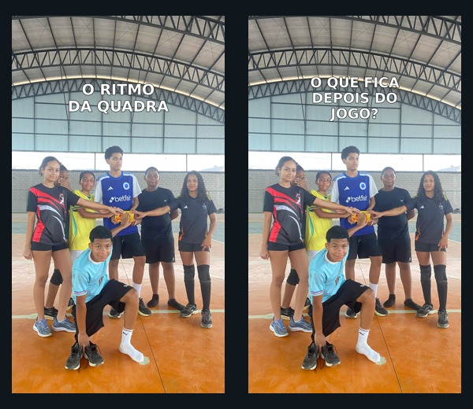
R1_capa.png e R2_capa.png, 1080 x 1920, fonte DejaVu Sans Bold. As quebras visíveis acima são as finais.

**Capa R1:** F02 com o mesmo recorte do início de A09; texto O RITMO DA QUADRA, fonte 76 px, centro (540,420), duas linhas, branco com contorno preto de 2 px. **Capa R2:** mesma foto, recorte do fim de B10; texto O QUE FICA DEPOIS DO JOGO?, 70 px, centro (540,420), três linhas. A capa é um arquivo separado e não acrescenta duração ao vídeo.

**Legenda R1:** Uma bola, muita troca e gente em movimento. Quem você chamaria para jogar?
**Legenda R2:** Entre um passe e outro, ficam os encontros, as risadas e as histórias. Compartilhe com quem joga com você.

---

## Melhorias para elevar o impacto

### Maior ganho: recuperar arquivos melhores

Pedir os vídeos originais da câmera, preferencialmente enviados como arquivos/documentos. V01 e V02 chegaram a 832 x 464, e nenhuma exportação em 4K corrige essa limitação. Se forem recuperados, manter o mesmo conteúdo de corte e conferir se o início da gravação coincide; os tempos deste manual só valem diretamente para as cópias analisadas. Não substituir automaticamente por outra duração.

### Maior ganho narrativo: recuperar a fala

Ouvir e transcrever integralmente V02 e o final de V01. Uma fala breve e concreta sobre o encontro pode permitir uma terceira versão, ou uma revisão posterior do R2 com depoimento e imagens de apoio. Essa melhoria exige conteúdo verbal validado, não uma legenda gerada por suposição. Na versão atual, o editor executa os dois roteiros sem falas; não precisa escolher um depoimento por conta própria.

### Na próxima captação

Registrar simultaneamente planos verticais dedicados de 5-8 s: recepção, mãos com a bola, corrida passando perto da câmera, reação após o lance, conversa entre participantes e grupo olhando para a lente. Manter 1 s antes e depois da ação. Evitar filmar uma pessoa e virar imediatamente para outra; gravar clipes separados para cada assunto.

Para câmera lenta, captar ação em 60 fps com boa luz; para falas, aproximar o microfone e buscar um local menos reverberante. Gravar também 15-20 s de ambiente da quadra. Captar uma foto horizontal e uma vertical do grupo, com todos os rostos visíveis, e um plano limpo da identidade oficial do evento, caso exista.

### O que medir depois de publicar

Comparar a retenção do início, o tempo médio assistido em relação à duração de cada Reel, a curva de abandono e os compartilhamentos por visualização. Como R1 tem 24 s e R2 tem 30 s, comparar só segundos médios pode confundir; dividir o tempo médio pela duração ajuda a interpretar. Sem dados da conta, não há meta numérica confiável a prometer.

Se R1 perder público na abertura, testar um início em velocidade normal com o mesmo gesto. Se a queda aparecer no plano horizontal de corrida, testar uma versão mais curta dessa passagem, preservando a trajetória da bola. Se R2 perder público nas pessoas diante da câmera, substituir parte desse apoio por uma fala realmente validada ou por novos detalhes verticais. Esses são testes futuros; não alterações abertas para a montagem-base.

### Fontes e limites

Evidência principal: os oito arquivos do ZIP enviado. Contexto e cenas vêm de inspeção visual, medições de duração/resolução/FPS/codec e análise de amostras de áudio. Identidades, falas, finalidade oficial e resultados esportivos não foram confirmados.

Referências oficiais do CapCut, consultadas em 04/09/2026:
Keyframes: https://www.capcut.com/resource/how-to-add-keyframes-in-capcut
Recorte: https://www.capcut.com/resource/how-to-crop-video-in-capcut-pc
Fundo desfocado: https://www.capcut.com/resource/how-to-blur-videos-in-capcut
Importação de SRT: https://www.capcut.com/help/how-to-import-subtitles

As funções citadas foram verificadas na documentação, não executadas no CapCut nesta sessão. O roteiro foi conferido por cálculo de duração e composição em quadros. As bases musicais foram geradas e medidas, com revisão auditiva pendente. O próximo passo operacional é a montagem no aplicativo e a conferência dos exports.
